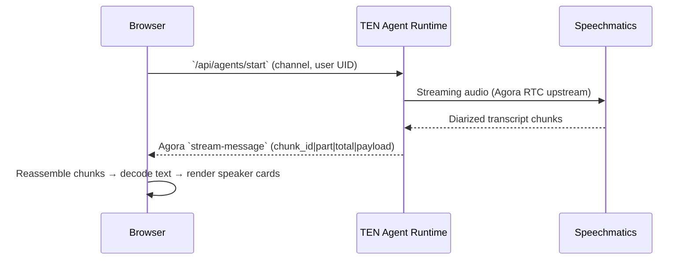

> Diarization is the art of answering a simple question: _"who said what?"_  
> In this post we will wire up TEN Framework, Speechmatics, and a light Next.js UI so every utterance carries both the speaker ID and the transcript.

## Architecture at a Glance



Key pieces:

- TEN agent - orchestrates audio capture, Speechmatics API calls, and downstream formatting.
- Speechmatics diarization - returns transcripts with speaker labels (`{"speaker": "S1"}` style metadata).
- Agora RTC - carries mic audio upstream and synthesized speech downstream.
- Next.js UI - listens to TEN stream-message events, reconstructs UTF-8 payloads, and surfaces speakers with avatars.

### 1. Speechmatics Setup

You will need an API key and a diarization-enabled task.

```
# .env (server root)
SPEECHMATICS_API_KEY=sk_your_key
```

The diarization task in `graph.json` (simplified):

```json
{
  "type": "speechmatics_diarization",
  "config": {
    "language": "en",
    "diarization": {
      "max_speakers": 4
    }
  }
}
```

TEN Speechmatics extension already handles authentication; just expose the key.

### 2. Agent Flow: From Audio to Diarized Text

**ASR Event Handler**

Inside `llm_exec.py` (or the companion orchestrator) we listen to `ASRResultEvent`:

```python
@agent_event_handler(ASRResultEvent)
async def _on_asr_result(self, event: ASRResultEvent):
    speaker = event.metadata.get("speaker", "")
    text = event.text or ""
    final = event.final

    label = self._format_speaker_label(speaker)
    self.ten_env.log_info(f"[ASR] {label}: {text}")

    await self._send_transcript(
        role="assistant",
        text=f"[{label}] {text}",
        is_final=final,
        timestamp=int(time.time() * 1000),
    )
```

Speechmatics returns the diarization tag in metadata (`speaker`, `channel`). We convert it into consistent labels (for example, `[S1]`, `[Elliot]`).

**Packaging Chunks for the Frontend**

Chunks are base64 encoded and streamed via Agora data channels:

```python
chunk = f"{message_id}|{part_index}|{total_parts}|{payload_b64}"
await self._send_to_client(chunk)
```

This keeps large payloads arriving in ordered slices without breaking real-time delivery.

### 3. Frontend: Reassembling & Rendering

**Chunk Cache**

In `src/app/page.tsx`, store each message in a `Map` keyed by `part_index`. Duplicate parts overwrite the existing entry:

```tsx
const cacheRef = useRef<Map<string, Map<number, TextChunk>>>(new Map());

messageCache.set(part_index, chunk);

if (messageCache.size === total_parts) {
  const payloadRaw = reconstructMessage(Array.from(messageCache.values()));
  const payload = JSON.parse(base64ToUtf8(payloadRaw));
  // ...
  cache.delete(message_id);
}
```

**Decoding the Payload**

Each chunk contains the raw transcript plus diarization hints:

```tsx
const decoded = streamDecoder.decode(stream);
const [messageId, partStr, totalStr, content] = parseHeader(decoded);
```

`parseHeader` locates the first three `|` characters so payloads can safely include additional delimiters.

**Speaker Extraction**

Enforce `[Speaker] Utterance` format and split in the UI:

```tsx
const extractSpeaker = (raw: string) => {
  const match = raw.match(/^\[([^\]]+)\]\s*/);
  return {
    speaker: match ? match[1] : undefined,
    text: match ? raw.slice(match[0].length) : raw,
  };
};
```

The UI then color codes cards, highlights the active speaker, and displays "...listening" states while interim transcripts arrive.

### 4. Environment & Routing

Next.js middleware rewrites API calls to the TEN agent without losing query strings:

```ts
if (pathname.startsWith("/api/agents/")) {
  const target = new URL(AGENT_SERVER_URL);
  target.pathname = pathname.replace("/api/agents/", "/");
  target.search = req.nextUrl.search;
  return NextResponse.rewrite(target);
}
```

The frontend loads its configuration from `.env` (generated from `.env.example`) and uses `genUUID()` for request IDs to keep logs consistent.

### 5. UX Touches

- Rolling gallery shows a 3D carousel of recognized speakers and updates their status to "Speaking" or "Waiting."
- Spotlight animations use CSS entry transitions to draw attention to new speaker cards.
- Active speaker tracking drives accent colors and keeps the latest speaker visible with `scrollIntoView`.

### 6. Hardening Tips

| Concern | Mitigation |
| --- | --- |
| Duplicate chunks | `Map<number, chunk>` deduplicates by `part_index`. |
| Partial payload flush | Cache clears on stop, and messages are removed after full reconstruction. |
| Unknown speaker labels | `_normalize_label()` collapses variants (for example, "Musk" versus "mask"). |
| Query string loss in middleware | Rewrites use URL objects and preserve the search string. |
| API responses | `normalizeApiResponse()` centralizes the `ok/code/msg/data` logic for consistent error handling. |

### 7. Running Everything

```bash
# Backend: start the TEN agent
task use AGENT=speechmatics-diarization
task run

# Frontend: configure and run
cd agents/examples/speechmatics-diarization/frontend
cp .env.example .env
pnpm install
pnpm dev
```

Visit `http://localhost:3000`, click Start, and speak into the mic. Speechmatics will diarize the audio, the TEN agent will relay speaker labels, and the UI will show each person's words in context.

## Wrapping Up

With TEN, Speechmatics, and Agora working together, diarization becomes a straightforward pipeline:

1. Capture real-time audio.
2. Hand it off to a diarization capable ASR service.
3. Normalize speaker metadata.
4. Stream structured chunks back to the browser.
5. Reconstruct and surface those chunks beautifully.

The result is a responsive assistant that not only hears the conversation but also remembers who said what.
